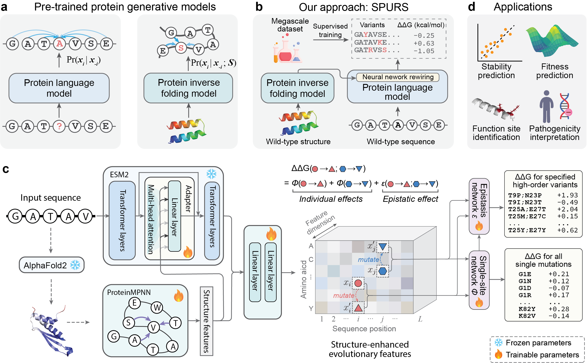

# <div align="center">SPURS</div>
<div align="center">
  <strong>Generalizable and scalable protein stability prediction with rewired protein generative models</strong>
</div>

<div align="center">
  <a href="https://pytorch.org/get-started/locally/"></a>
  <a href="https://github.com/ashleve/lightning-hydra-template"></a>
  <br>
  <a href="https://spurs.readthedocs.io/en/latest/"></a>
  <a href="https://www.biorxiv.org/content/10.1101/2025.02.13.638154v2"></a>
  <a href="https://huggingface.co/cyclization9/SPURS/tree/main"></a>
</div>

<div align="center">
  
</div>

SPURS is an accurate, rapid, scalable, and generalizable stability predictor. This repository is the official implementation of the paper [Generalizable and scalable protein stability prediction with rewired protein generative models](https://www.nature.com/articles/s41467-025-67609-4). For detailed documentation, please visit our [documentation site](https://spurs.readthedocs.io/en/latest/).

## 🛠️ Environment

```shell
# Tested on Ubuntu 20.04, the setup completes within minutes.
conda create -n spurs python=3.7 pip
conda activate spurs


pip install -e .

pip install torch==1.12.0+cu113 torchvision==0.13.0+cu113 torchaudio==0.12.0 --extra-index-url https://download.pytorch.org/whl/cu113

pip install git+https://github.com/facebookresearch/esm.git
```

## 🔍 Inference
SPURS achieves both efficient and accurate single mutation prediction. Additionally, we have developed an extension module for SPURS that enables multi-mutation prediction. SPURS demonstrates superior performance compared to current leading stability predictors in both single and multi-mutation scenarios.

### Single Mutation Prediction
```python
from spurs.inference import get_SPURS, parse_pdb, get_SPURS_from_hub
# load model from huggingface
# ~ 10s
model, cfg = get_SPURS_from_hub()
pdb_name = 'DOCK1_MOUSE'
pdb_path = './data/inference_example/' + pdb_name + '.pdb'
chain = 'A'
pdb = parse_pdb(pdb_path, pdb_name, chain, cfg)
# ~ 1s
model.eval()
with torch.no_grad():
  ddg = model(pdb,return_logist=True)
```
The results have been already normalized, so the value in `ddg` for wild-type amino acids are zero.
```python
# wild-type amino acid at position 1
wt_aa = pdb['seq'][0]
ALPHABET = 'ACDEFGHIKLMNPQRSTVWY'
ddg_wt = ddg[0,ALPHABET.index(wt_aa)]
ddg_wt # should be 0
```

For mutation: `W1A`:
```python
mt_aa = 'A'
ALPHABET = 'ACDEFGHIKLMNPQRSTVWY'
ddg_mt = ddg[0,ALPHABET.index(mt_aa)]
ddg_mt # ddg for W1A
```

### Multi-mutation Prediction
```python
from spurs.inference import parse_pdb, get_SPURS_multi_from_hub, parse_pdb_for_mutation
import torch

mut_info_list = [
    ['V2C','P3T'], # multi-mutation 1
    ['W1A','V2Y',], # multi-mutation 2
]
pdb_name = 'DOCK1_MOUSE'
pdb_path = './data/inference_example/' + pdb_name + '.pdb'
chain = 'A'
device = torch.device('cuda' if torch.cuda.is_available() else 'cpu')

model, cfg = get_SPURS_multi_from_hub()

pdb = parse_pdb(pdb_path, pdb_name, chain, cfg)
mut_ids, append_tensors = parse_pdb_for_mutation(mut_info_list)
pdb['mut_ids'] = mut_ids
pdb['append_tensors'] = append_tensors.to(device)
model.eval()
with torch.no_grad():
  ddg = model(pdb)
ddg # ddg[i] for mut_info_list[i]
```

## 🎯 Functional Site Identification
SPURS can assign function scores to each position of the protein with protein sequence and structure as input. An example can be found at [./notebooks/functional_site_identification.ipynb](./notebooks/functional_site_identification.ipynb).

Below is the visualization of the ground truth functional sites(X) and function scores assigned by SPURS for LIM domain in FHL1 (UniProt ID: Q13642; PDB ID: 1X63).
<div align="center">
  
</div>


## 📦 Data
Download `data.tar.gz` from [link](https://www.dropbox.com/scl/fi/uo4e6lvptyy9df5xfulsc/data.tar.gz?rlkey=voi6fxu6ojbzwdk67jlooy8kb&st=4iinnpbc&dl=0).
```shell
wget https://www.dropbox.com/scl/fi/uo4e6lvptyy9df5xfulsc/data.tar.gz?rlkey=voi6fxu6ojbzwdk67jlooy8kb&st=4iinnpbc&dl=0
tar -xzvf data.tar.gz
```

## 🔄 Reproduce result
### Stability Prediction
Evaluation on the test sets:


```bash
# general usage, only model and test dataset should be specified.
python ./test.py  experiment_path={checkpoint_path} datamodule._target_={dataset_name} data_split=test ckpt_path=best.ckpt mode=predict 
```
while model checkpoints can be selected from [data/checkpoints](./data/checkpoints), and datamodule can be selected from `megascale` and `domainome`.
```bash
## SPURS on Megascale and ten test sets
python ./test.py  experiment_path=data/checkpoints/spurs datamodule._target_=megascale data_split=test ckpt_path=best.ckpt mode=predict 


### ThermoMPNN on Domainome
python ./test.py  experiment_path=data/checkpoints/ThermoMPNN datamodule._target_=domainome data_split=test ckpt_path=best.ckpt mode=predict 
```


Results on Megascale and ten test sets can be processed using [convert.ipynb](./notebooks/convert.ipynb)

### Fitness Prediction

<!-- First change the line 13 of `${CONDA_PREFIX}/lib/python3.7/site-packages/skopt/__init__.py`
```python
from importlib.metadata import version, PackageNotFoundError
```
to 
```python
from importlib_metadata import version, PackageNotFoundError
``` -->


To run fitness prediction
```shell
cd experiments/combining-evolutionary-and-assay-labelled-data
export PROJECT_ROOT=$PWD/../../
python run_proteingym.py
```
This command will use all accessible CPU cores by default. If you want to use a specific range of CPUs, such as CPU0-80, you can use:
```shell
taskset -c 0-80 python run_proteingym.py
```

SPURS-augmented models were built upon the [Augmented models](https://www.nature.com/articles/s41587-021-01146-5) framework (Hsu et al., *Nat biotechnology*, 2022). We adapted the code from the original [GitHub repo](https://github.com/chloechsu/combining-evolutionary-and-assay-labelled-data) (commit `fdaa5bb`) and retained only the necessary files. A [`DDGPredictor`](https://github.com/li-ziang/psnet-release/blob/main/combining-evolutionary-and-assay-labelled-data/src/predictors/esm_predictors.py#L14) is added to introduce predicted ddG into the regression model.


### Citation
If you find `SPURS` useful in your research, please consider cite our paper:
```
@article{li2025generalizable,
  title={Generalizable and scalable protein stability prediction with rewired protein generative models},
  author={Li, Ziang and Luo, Yunan},
  journal={Nature Communications},
  year={2025},
  publisher={Nature Publishing Group UK London}
}
```

### Reference
Our work is based on the following works, which have made the development of SPURS faster and easier: [ProteinMPNN](https://github.com/dauparas/ProteinMPNN), [ThermoMPNN](https://github.com/Kuhlman-Lab/ThermoMPNN), [ESM](https://github.com/facebookresearch/esm), [Lightning-Hydra-Template](https://github.com/ashleve/lightning-hydra-template) and [ByProt](https://github.com/BytedProtein/ByProt).

ProteinMPNN
```
@article{dauparas2022robust,
  title={Robust deep learning--based protein sequence design using ProteinMPNN},
  author={Dauparas, Justas and Anishchenko, Ivan and Bennett, Nathaniel and Bai, Hua and Ragotte, Robert J and Milles, Lukas F and Wicky, Basile IM and Courbet, Alexis and de Haas, Rob J and Bethel, Neville and others},
  journal={Science},
  volume={378},
  number={6615},  
  pages={49--56},
  year={2022},
  publisher={American Association for the Advancement of Science}
}
```
ThermoMPNN
```
@article{
doi:10.1073/pnas.2314853121,
author = {Henry Dieckhaus  and Michael Brocidiacono  and Nicholas Z. Randolph  and Brian Kuhlman },
title = {Transfer learning to leverage larger datasets for improved prediction of protein stability changes},
journal = {Proceedings of the National Academy of Sciences},
volume = {121},
number = {6},
pages = {e2314853121},
year = {2024},
doi = {10.1073/pnas.2314853121},
URL = {https://www.pnas.org/doi/abs/10.1073/pnas.2314853121},
eprint = {https://www.pnas.org/doi/pdf/10.1073/pnas.2314853121},
}
```
ESM
```
@article{rives2021biological,
  title={Biological structure and function emerge from scaling unsupervised learning to 250 million protein sequences},
  author={Rives, Alexander and Meier, Joshua and Sercu, Tom and Goyal, Siddharth and Lin, Zeming and Liu, Jason and Guo, Demi and Ott, Myle and Zitnick, C Lawrence and Ma, Jerry and others},
  journal={Proceedings of the National Academy of Sciences},
  volume={118},
  number={15},
  pages={e2016239118},
  year={2021},
  publisher={National Acad Sciences},
  note={bioRxiv 10.1101/622803},
  doi={10.1073/pnas.2016239118},
  url={https://www.pnas.org/doi/full/10.1073/pnas.2016239118},
}
```
ByProt
```
@inproceedings{zheng2023lm_design,
    title={Structure-informed Language Models Are Protein Designers},
    author={Zheng, Zaixiang and Deng, Yifan and Xue, Dongyu and Zhou, Yi and YE, Fei and Gu, Quanquan},
    booktitle={International Conference on Machine Learning},
    year={2023}
}
```
